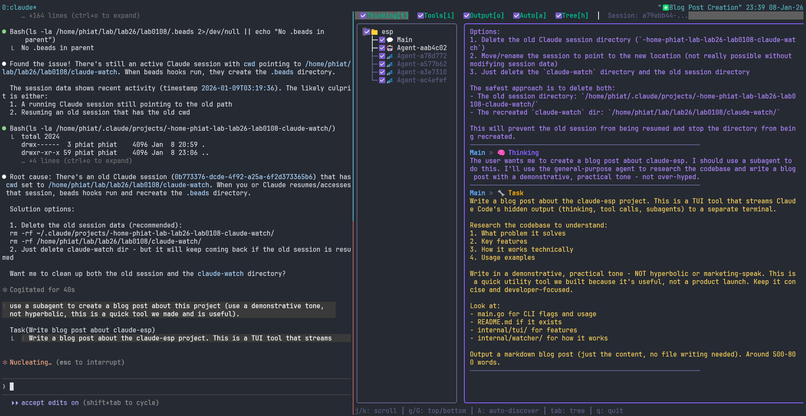

# claude-esp

[](https://pkg.go.dev/github.com/phiat/claude-esp)

Stream Claude Code's hidden output (thinking, tool calls, subagents) to a separate terminal in real-time.



Looking for the Rust port? See: [claude-esp-rs](https://github.com/phiat/claude-esp-rs)

## The Problem

When using Claude Code interactively, tool outputs and thinking are collapsed by default and require pressing `Ctrl+O` to toggle visibility. This tool lets you watch all that output in a **separate terminal** with a nice TUI, without interrupting your main Claude Code session.

## Features

- **Multi-session support** - Watch all active Claude sessions simultaneously
- **Hierarchical tree view** - Sessions with nested Main/Agent nodes
- **Real-time streaming** - See thinking, tool calls, and outputs as they happen
- **Subagent tracking** - Automatically discovers and displays subagent activity
- **Background task visibility** - See background tasks (⏳/✓) under spawning agent
- **Filtering** - Toggle visibility of thinking, tools, outputs per session/agent
- **Auto-scroll** - Follows new output, or scroll freely through history

## Requirements

- Go 1.23 or later

## Installation

```bash
# Install directly via go install
go install github.com/phiat/claude-esp@latest

# Or clone and build from source
git clone https://github.com/phiat/claude-esp.git
cd claude-esp
go build -o claude-esp .

# Optional: install to PATH
cp claude-esp ~/.local/bin/
```

### Pre-built binaries

Download pre-built binaries from the [Releases](https://github.com/phiat/claude-esp/releases) page. Available for Linux (amd64, arm64), macOS (amd64, arm64), and Windows (amd64).

## Usage

```bash
# In your main terminal: run Claude Code as normal
claude

# In a second terminal/tmux pane: run the watcher
claude-esp
```

### Options

| Option     | Description                                   |
| ---------- | --------------------------------------------- |
| `-s <ID>`  | Watch a specific session by ID                |
| `-n`       | Start from newest (skip history, live only)   |
| `-l`       | List recent sessions                          |
| `-a`       | List active sessions (modified in last 5 min) |
| `-p <ms>`  | Poll interval in milliseconds (default 500)   |
| `-v`       | Show version                                  |
| `-h`       | Show help                                     |

### Environment Variables

| Variable      | Description                                         |
| ------------- | --------------------------------------------------- |
| `CLAUDE_HOME` | Override Claude config directory (default: `~/.claude`) |

### Examples

```bash
# Watch all active sessions
claude-esp

# Skip history, only show new output
claude-esp -n

# List active sessions
claude-esp -a

# Watch a specific session
claude-esp -s 0b773376

# Faster poll interval (200ms)
claude-esp -p 200

# List recent sessions
claude-esp -l
```

## Keybindings

| Key       | Action                                    |
| --------- | ----------------------------------------- |
| `t`       | Toggle thinking visibility                |
| `i`       | Toggle tool input visibility              |
| `o`       | Toggle tool output visibility             |
| `a`       | Toggle auto-scroll                        |
| `h`       | Hide/show tree pane                       |
| `A`       | Toggle auto-discovery of new sessions     |
| `tab`     | Switch focus between tree and stream      |
| `j/k/↑/↓` | Navigate tree or scroll stream            |
| `space`   | Toggle selected item in tree              |
| `enter`   | Load background task output (when selected)|
| `x/d`     | Remove selected session from tree         |
| `g/G`     | Go to top/bottom of stream                |
| `q`       | Quit                                      |

## How It Works

Claude Code stores conversation transcripts as JSONL files in:

```
~/.claude/projects/<project-path>/<session-id>.jsonl
```

Subagents are stored in:

```
~/.claude/projects/<project-path>/<session-id>/subagents/agent-<id>.jsonl
```

Background task outputs are stored in:

```
~/.claude/projects/<project-path>/<session-id>/tool-results/toolu_*.txt
```

The watcher:

1. Discovers active sessions (modified in last 5 minutes)
2. Polls JSONL files every 500ms for new content
3. Parses JSON lines and extracts thinking/tool_use/tool_result
4. Discovers background tasks and correlates them with spawning agents
5. Renders them in a TUI with tree navigation and filtering

## tmux Setup

Recommended tmux layout:

```bash
# Create a new tmux session with two panes
tmux new-session -s claude \; \
  split-window -h \; \
  send-keys 'claude-esp' C-m \; \
  select-pane -L \; \
  send-keys 'claude' C-m
```

Or add to your `.tmux.conf`:

```
bind-key C-c new-window -n claude \; \
  send-keys 'claude' C-m \; \
  split-window -h \; \
  send-keys 'claude-esp' C-m \; \
  select-pane -L
```

Then press `prefix + Ctrl+C` to open a Claude Code workspace.

## Project Structure

```
claude-esp/
├── main.go                 # CLI entry point
├── internal/
│   ├── parser/
│   │   └── parser.go       # JSONL parsing
│   ├── watcher/
│   │   └── watcher.go      # File monitoring
│   └── tui/
│       ├── model.go        # Bubbletea main model
│       ├── tree.go         # Session/agent tree view
│       ├── stream.go       # Stacked output stream
│       └── styles.go       # Lipgloss styling
```

## Development

Built with [Bubbletea](https://github.com/charmbracelet/bubbletea) and [Lipgloss](https://github.com/charmbracelet/lipgloss). Issue tracking was done with [beads](https://github.com/steveyegge/beads).

```bash
# Run tests
go test ./...

# Build
go build -o claude-esp .

# Build with version injection
go build -ldflags "-X main.version=0.2.0" -o claude-esp .
```

## License

MIT
